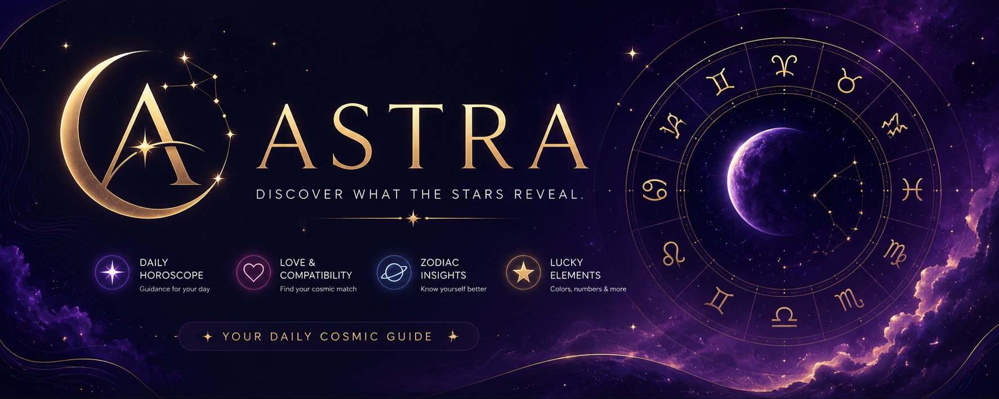

# 🌙 Astra

<div align="center">



### ✨ Discover What the Stars Reveal ✨

A modern astrology and horoscope web application that delivers personalized cosmic guidance through horoscope readings, zodiac insights, compatibility analysis, and immersive celestial experiences.


</div>

---

## 🌌 About Astra

Astra is a modern astrology platform designed to provide users with personalized horoscope readings, zodiac discoveries, and compatibility insights through a premium and immersive experience.

Unlike traditional horoscope websites cluttered with advertisements and outdated interfaces, Astra embraces a clean, modern, and mobile-first design philosophy inspired by:

* 🍎 Apple Weather
* 🌠 Co-Star Astrology
* 🔮 Nebula Astrology
* 🎵 Spotify Dashboard UI

The goal is to create a calming, elegant, and visually engaging cosmic companion for daily astrology enthusiasts.

---

## ✨ Features

### 🔮 Horoscope Experience

* Daily Horoscope Readings
* Zodiac Sign Discovery
* Birthdate-Based Zodiac Detection
* Personalized Zodiac Dashboard
* Horoscope Sharing & Copy Feature

### 🌙 Astrology Insights

* Zodiac Personality Traits
* Compatibility Analysis
* Lucky Numbers
* Lucky Colors
* Daily Mood Indicators

### 🎨 User Experience

* Responsive Mobile-First Design
* Dark Cosmic Theme
* Animated Celestial Backgrounds
* Glassmorphism UI Components
* Smooth Page Animations
* Accessible Navigation

### 💾 Personalization

* Save Favorite Zodiac Sign
* Persistent User Preferences
* LocalStorage Integration
* No Account Required

---

## 📸 Preview

### Home Page

```txt
Hero Section
↓
Zodiac Selection Grid
↓
Horoscope Dashboard
↓
Compatibility Insights
↓
Quick Cosmic Guidance
```

### Horoscope Dashboard

```txt
Selected Zodiac Sign
Mood
Lucky Number
Compatibility
Daily Horoscope
Quick Insights
```

---

## 🛠 Tech Stack

### Frontend

* React
* Tailwind CSS
* JavaScript (ES6+)
* Vite

### API

* API Ninjas Horoscope API

### Storage

* LocalStorage

### Deployment

* Vercel

---

## 🏗 Project Structure

```plaintext
src/
│
├── components/
│   ├── Navbar.jsx
│   ├── Hero.jsx
│   ├── ZodiacGrid.jsx
│   ├── HoroscopeCard.jsx
│   ├── CompatibilityCard.jsx
│   ├── QuickInsights.jsx
│   ├── Loader.jsx
│   └── Toast.jsx
│
├── data/
│   └── zodiacSigns.js
│
├── services/
│   └── horoscopeApi.js
│
├── utils/
│   ├── zodiacUtils.js
│   └── localStorage.js
│
├── App.jsx
├── main.jsx
└── index.css
```

---

## 🚀 Installation

### Clone Repository

```bash
git clone https://github.com/yourusername/astra.git
```

### Navigate to Project

```bash
cd astra
```

### Install Dependencies

```bash
npm install
```

### Create Environment File

```env
VITE_HOROSCOPE_API_KEY=YOUR_API_KEY
```

### Run Development Server

```bash
npm run dev
```

---

## 🔑 Environment Variables

Create a `.env` file:

```env
VITE_HOROSCOPE_API_KEY=your_api_key_here
```

Get your API key from:

https://api-ninjas.com

---

## 🌟 Design Philosophy

Astra follows four core design principles:

### 🌙 Mystical

A celestial aesthetic inspired by astronomy and astrology.

### ✨ Elegant

Premium spacing, typography, and visual hierarchy.

### 🔮 Personalized

User-focused experiences through zodiac-based customization.

### ⚡ Modern

Fast, responsive, and accessible design built for all devices.

---

## 🎨 Design System

### Colors

```css
Galaxy Black  #020617
Deep Space    #0F172A
Cosmic Purple #6D28D9
Gold Star     #FBBF24
Moon White    #F8FAFC
Silver Mist   #CBD5E1
```

### Typography

```txt
Poppins
Inter
```

### UI Style

```txt
Glassmorphism
Cosmic Gradients
Soft Shadows
Rounded Components
Animated Stars
```

---

## 📱 Responsive Design

### Mobile

* Single-column layout
* Touch-friendly interactions
* Collapsible navigation

### Tablet

* Two-column dashboard
* Optimized spacing

### Desktop

* Multi-column dashboard
* Enhanced visual hierarchy

---

## 🧠 Challenges & Learnings

### Challenges

* Designing an immersive astrology experience without sacrificing performance.
* Balancing animations with readability.
* Creating a premium aesthetic while maintaining accessibility.

### Learnings

* Mobile-first development improves scalability.
* Minimalistic interfaces improve engagement.
* Strong visual identity creates memorable user experiences.

---

## 🔭 Future Enhancements

### Planned Features

* Weekly Horoscope
* Monthly Horoscope
* Yearly Horoscope
* AI Horoscope Interpretations
* Zodiac Compatibility Engine
* Birth Chart Generation
* Astrology Event Tracking
* Theme Customization
* Multi-language Support

---

## 🤝 Contributing

Contributions, suggestions, and feedback are welcome.

```bash
Fork the repository
Create a feature branch
Commit your changes
Submit a pull request
```

---

## 📄 License

This project is licensed under the MIT License.

---

<div align="center">

### 🌙 Astra

**Your Daily Cosmic Guide**

Discover your zodiac.
Understand your cosmic energy.
Explore what the stars reveal.

⭐ If you like this project, consider giving it a star!

</div>
